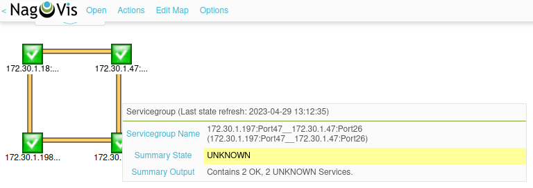
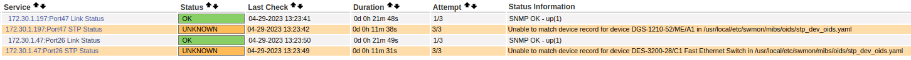
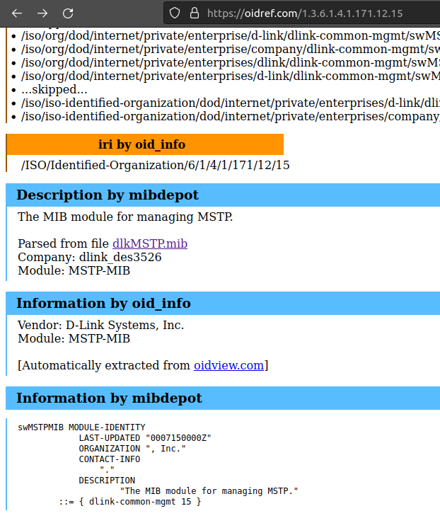
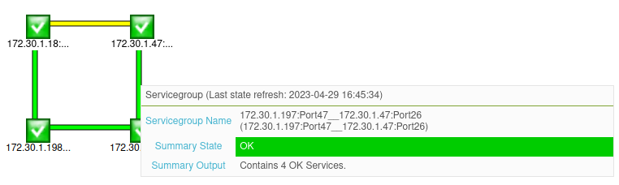

# SWMON
### simple L2 SNMP network maper

|    | 
|:-----------------------:| 
| *(4 switches RSTP map)* |

## How It works:
Swmon scan defined network blocks with ping. All hosts responded
to ping will be probed with SNMP checks. Swmon will try to gather
system information, LLDP connectivity and STP port statuses. Then, it will 
try to "connect all the ends" and build logical topology of network.

### Output format:
As result of scan swmon will generate two .cfg files and one .json: 
 - `swmon_nagios_hosts.cfg` - [Nagios](https://github.com/NagiosEnterprises/nagioscore) 
   config file filled with hosts, child/parent relations and services to monitor network. 
   You can configure Nagios to include this file.
 - Unfortinatly, bare-bones Nagios do not provide much configuration to draw
   fancy maps. Second .cfg swmon will generate is [Nagvis](https://github.com/NagVis/nagvis)
   static map definition. File name and path is configurable.
 - `swmon_hosts_model.json` - data model including all SNMP vars swmon gathered. 
 

You can use [Nagvis](https://github.com/NagVis/nagvis) + [Nagios](https://github.com/NagiosEnterprises/nagioscore) + 
[Backend](http://docs.nagvis.org/1.9/en_US/backends.html)([ndoutils](https://github.com/NagiosEnterprises/ndoutils)), 
as I do, to monitor scanned networks, but you are welcome to use other software you find compatible.


### Network devices requirments:

 - SNMPv2 supported and enabled on devices (SNMPv3 is not supported yet)
 - Known community string
 - IPv4 addresses
 - LLDP data avaliable by SNMP
 - STP data avaliable by SNMP

### "Front-End":

 - [Nagios](https://github.com/NagiosEnterprises/nagioscore)
 - [Nagios Plugins](https://github.com/nagios-plugins/nagios-plugins)
 - [Nagvis*](https://github.com/NagVis/nagvis), version > 1.9.34 if you want to use MySQL 8.* (you can install it from my submodule in /deps. I fixed some minor MySQL 8.* incompatibility)
 - Some [Nagvis backend](http://docs.nagvis.org/1.9/en_US/backends.html) - I use [ndoutils](https://github.com/NagiosEnterprises/ndoutils) + MySQL 8.* database to collect Nagios data

## Installation

### From sources
Go 1.19 is reqired to build the sources.
```bash
make install clean
```

### From build

Download latest build, then:

```bash
 chmod +x install.sh
 ./install.sh
```

Installation script will copy necesary binaries to `/usr/local/bin`  
Program files copied to `/usr/local/etc/swmon`

## Usage

### Setup
First, you need to create a default config

```
 # sudo swmon_mapper -c
 Default config created!
```

```yaml
logs_path: /usr/local/etc/swmon/swmon_log
workers: 0
root_addr: ""
nagvis_map: /usr/local/nagvis/etc/maps/swmon-static.cfg
www_user: www-data
networks:
    - addr_blocks: ""
      snmp_community_string: public
      snmp_port: 161
      snmp_version: 2
      snmp_timeout: 15000
remove_unreachable_hosts: false
post_execution_command: sudo systemctl restart nagios
```

It is a bunch of settings. But required are `root_addr` and `nagvis_map` with at
least one network block. Config explained:

```yaml
logs_path: /usr/local/etc/swmon/swmon_log
workers: 0 # is auto
root_addr: "192.168.14.1" # will have no parents and be the N-gen parent for all other hosts
nagvis_map: /usr/local/nagvis/etc/maps/swmon-static.cfg # nagvis map will be created or updated
www_user: www-data # your www data user
networks: # can be a bunch
    - addr_blocks: "192.168.14.0/22,192.168.10.0/24" # CIDR format only
      snmp_community_string: somecomstring
      snmp_port: 161
      snmp_version: 2 # can be 1
      snmp_timeout: 15000
      
    - addr_blocks: "172.17.22.0/24"
      snmp_community_string: somecomstring
      snmp_port: 161
      snmp_version: 2
      snmp_timeout: 15000
      
remove_unreachable_hosts: false # make sense while updating existing files
post_execution_command: sudo systemctl restart nagios
```

You can use command line instead:

```bash
sudo swmon_mapper -n 192.168.225.0/24 -s public -r 192.168.225.201 -w 256
sudo swmon_mapper --help
```

### First run

```bash
sudo swmon_mapper -c -v
```
```
Testing LLDP MIBs persistence...
LLDP-MIB::lldpLocPortId: 1.0.8802.1.1.2.1.3.7.1.3
LLDP-MIB::lldpRemPortIdSubtype: 1.0.8802.1.1.2.1.4.1.1.6
LLDP-MIB::lldpRemPortId: 1.0.8802.1.1.2.1.4.1.1.7
LLDP-MIB::lldpRemPortDesc: 1.0.8802.1.1.2.1.4.1.1.8
LLDP-MIB::lldpRemSysName: 1.0.8802.1.1.2.1.4.1.1.9
LLDP-MIB::lldpRemSysDesc: 1.0.8802.1.1.2.1.4.1.1.10
LLDP-MIB::lldpRemChassisIdSubtype: 1.0.8802.1.1.2.1.4.1.1.4
LLDP-MIB::lldpRemChassisId: 1.0.8802.1.1.2.1.4.1.1.5
LLDP-MIB::lldpRemSysCapSupporte: 1.0.8802.1.1.2.1.4.1.1.11
LLDP-MIB::lldpRemSysCapEnabled: 1.0.8802.1.1.2.1.4.1.1.12
Swmon full scan started for blocks 192.168.14.0/22,192.168.10.0/24,172.17.22.0/24. It is 1536 unique addresses. Num workers: 1024
[192.168.12.22] Send ping...
[192.168.12.8] Send ping...
[192.168.12.1] Send ping...
[192.168.15.255] Send ping...
[192.168.15.28] Send ping...
[192.168.12.14] Send ping...
...
```
You will see a lot of output.  
But interesting in the last lines.

```
...
MAPPER: CREATING NAGVIS MAP /usr/local/nagvis/etc/maps/swmon-static.cfg...
MAPPER: CREATING NEW NAGVIS MAP ON PATH /usr/local/nagvis/etc/maps/swmon-static.cfg
Swmon execution done in 6.264937363s for 1536 unique addresses.
Map avaliable on http://localhost/nagvis/frontend/nagvis-js/index.php?mod=Map&act=view&show=swmon-static

```
Navigate to the `/usr/local/etc/swmon` directory:
```
drwxr-xr-x 5 root root    4096 ./
drwxr-xr-x 3 root root    4096 ../
drw-r--r-- 2 root root    4096 backup/
drwxr-xr-x 2 root root    4096 maps/
drwxr-xr-x 3 root root    4096 mibs/
-rw-r----- 1 root root     366 swmon_config.yaml
-rw-r--r-- 1 root root  183116 swmon_hosts_model.json
-rw-r--r-- 1 root root 1723078 swmon_log
-rw-r--r-- 1 root root   14537 swmon_nagios_hosts.cfg
```

You will see generated Nagios config `swmon_nagios_hosts.cfg`.  
Include it to your Nagios config.
```
sudo bash -c "echo "cfg_file=$(realpath swmon_nagios_hosts.cfg)" >> /usr/local/nagios/etc/nagios.cfg"
sudo systemctl restart nagios
```

Follow the link at the end of swmon output. All host will be located in top 
left corner. Click Edit Map -> Lock/Unlock All and drag it as you want.

Don't worry about orange "UNKNOWN" services we will fix it soon.

## STP Monitoring

After first scan you will end with the map with orage connections telling us that services status is
**'UNKNOWN'**.  




It is a predicted behaviour because we don't tell swmon which STP protocol devices are using
and how to retrive STP statuses.  
You need to edit `/usr/local/etc/swmon/mibs/oids/stp_dev_oids.yaml` to do that.

```yaml
- device_match_regex: DGS-1210-52/ME
  target_oid: SNMPv2-SMI::enterprises.171.10.76.29.1.6.2.1.12
  value_map: mstp_statuses

- device_match_regex: .*
  target_oid: MSTP-MIB::swMSTPMstPortStatus
  value_map: mstp_statuses
```

It's my MSTP monitoring setup I made for my test network (4 DLink switches). Two of them supports 
[MSTP-MIB](http://www.circitor.fr/Mibs/Html/M/MSTP-MIB.php) and the`MSTP-MIB::swMSTPMstPortStatus` 
oid is the root oid for port status checks.

You can use already shipped tool `stp_mib_scanner` to parse STP module from the device `sysORtable`

```
stp_mib_scanner -c some_community_str -h host_ip -w
```
And see output like follows:
```
Device name: DGS-3000-28L
Device description: DGS-3000-28L Gigabit Ethernet Switch
STP module name parsed from device table: swMSTPMIB
STP module OID parsed from device table: .1.3.6.1.4.1.171.12.15
Searching for supported user MIB module. Name of module may be swMSTPMIB.mib...
Module swMSTPMIB.mib not found in user MIBs.
STP module OID .1.3.6.1.4.1.171.12.15 from device table is valid OID
ROOT STP OID IS: .1.3.6.1.4.1.171.12.15
Press ENTER to list module values...
```
Now, you can use module OID to search for the MIB module. I offen use [oidref](https://oidref.com/).



Download needed MIB, place it in `/usr/local/etc/swmon/mibs` directory and name as module name in device oid
```
sudo mv ~/Downloads/dlkMSTP.mib /usr/local/etc/swmon/mibs/swMSTPMIB.mib
stp_mib_scanner -c somecomstr -h 192.14.1.18 -w
```
```
...
Module swMSTPMIB.mib found!
Searching for root node...
Root node is swMSTPMIB
STP module OID parsed from user MIB module swMSTPMIB.mib is 1.3.6.1.4.1.171.12.15
STP module OID .1.3.6.1.4.1.171.12.15 from device table is valid OID
ROOT STP OID IS: 1.3.6.1.4.1.171.12.15
Press ENTER to list module values...
```
Press ENTER and you will see port statuses oids somewhere in output.
```
...
MSTP-MIB::swMSTPMstPortStatus.20.0 = INTEGER: disabled(2)
MSTP-MIB::swMSTPMstPortStatus.21.0 = INTEGER: disabled(2)
MSTP-MIB::swMSTPMstPortStatus.22.0 = INTEGER: disabled(2)
MSTP-MIB::swMSTPMstPortStatus.23.0 = INTEGER: forwarding(5)
MSTP-MIB::swMSTPMstPortStatus.24.0 = INTEGER: forwarding(5)
MSTP-MIB::swMSTPMstPortStatus.25.0 = INTEGER: disabled(2)
MSTP-MIB::swMSTPMstPortStatus.26.0 = INTEGER: disabled(2)
...
```
Add port status root `MSTP-MIB::swMSTPMstPortStatus` to you config.
I match all devices model with this oid.
```
- device_match_regex: .*
  target_oid: MSTP-MIB::swMSTPMstPortStatus
```

### If there are no situable MIB module you can target raw OID. For example:
```
Device name: DGS-1210-52/ME
Device description: DGS-1210-52/ME/A1
STP module name parsed from device table: dlinkMSTP
STP module OID parsed from device table: .1.3.6.1.4.1.171.10.76.29.1.6
Searching for supported user MIB module. Name of module may be dlinkMSTP.mib...
Module dlinkMSTP.mib not found in user MIBs.
STP module OID .1.3.6.1.4.1.171.10.76.29.1.6 from device table is valid OID
ROOT STP OID IS: .1.3.6.1.4.1.171.10.76.29.1.6
Press ENTER to list module values...
```
There are no public record for oid .1.3.6.1.4.1.171.10.76.29.1.6  
List values and try to find port statuses somewhere in the device database.
```
...
DLINK-ID-REC-MIB::dlink-products.76.29.1.6.2.1.12.44 = INTEGER: 1
DLINK-ID-REC-MIB::dlink-products.76.29.1.6.2.1.12.45 = INTEGER: 1
DLINK-ID-REC-MIB::dlink-products.76.29.1.6.2.1.12.46 = INTEGER: 1
DLINK-ID-REC-MIB::dlink-products.76.29.1.6.2.1.12.47 = INTEGER: 5
DLINK-ID-REC-MIB::dlink-products.76.29.1.6.2.1.12.48 = INTEGER: 5
DLINK-ID-REC-MIB::dlink-products.76.29.1.6.2.1.12.49 = INTEGER: 1
DLINK-ID-REC-MIB::dlink-products.76.29.1.6.2.1.12.50 = INTEGER: 1
...
```
We knew that ports 47 and 48 are linked. According to MSTP values map value 5 is "forwarding".
```
mstp_statuses:
    1: "Unknown: other(1)"
    2: "Unknown: disabled(2)"
    3: "Warning: discarding(3)"
    4: "Unknown: learning(4)"
    5: "OK: forwarding(5)"
    6: "Critical: broken(6)"
    7: "Unknown: no-stp-enabled(7)"
    8: "Critical: err-disabled(8)"
```
Oid `DLINK-ID-REC-MIB::dlink-products.76.29.1.6.2.1.12` looks like the best candidate.

Add it to config
```
- device_match_regex: DGS-1210-52/ME
  target_oid: DLINK-ID-REC-MIB::dlink-products.76.29.1.6.2.1.12
  value_map: mstp_statuses

- device_match_regex: .*
  target_oid: MSTP-MIB::swMSTPMstPortStatus
  value_map: mstp_statuses
```

And clear swmon cache like every time you need to change target OIDs.
```
sudo rm /tmp/swmon_*
```



You can also add your own values maps in `/usr/local/etc/swmon/mibs/oids/value_maps.yaml` file and 
monitor whatever protocol you want.

## Some usage tips

 - **[Set](https://support.nagios.com/forum/viewtopic.php?f=7&t=60813) Nagios `interval_length` to `1` for "realtime" monitoring.**
 - **Swmon will not entirely rewrite your map. Swmon will not delete any host already on the map. 
If the map exists it will only add some new hosts found and update data for the old hosts (links etc).
So, you can safely customize you map and then run swmon scans. Use -f flag if you want to delete old hosts will
not find in upcoming scan.**

## Licence

This is a free software under GNU GENERAL PUBLIC LICENSE. See LICENCE for more details.

## Thanks

Big thank to developers of [GoSNMP](https://github.com/gosnmp/gosnmp) library.